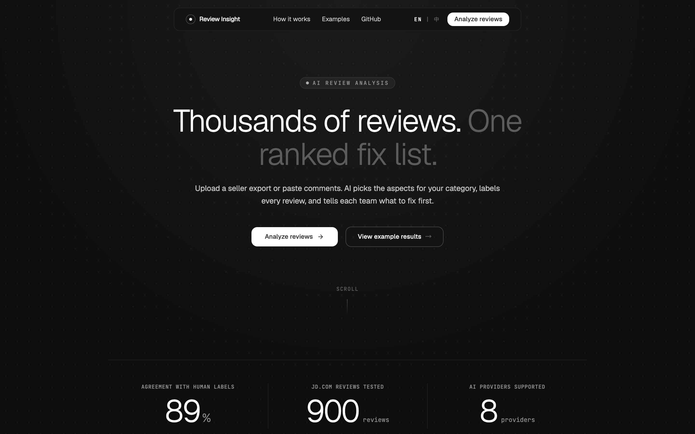
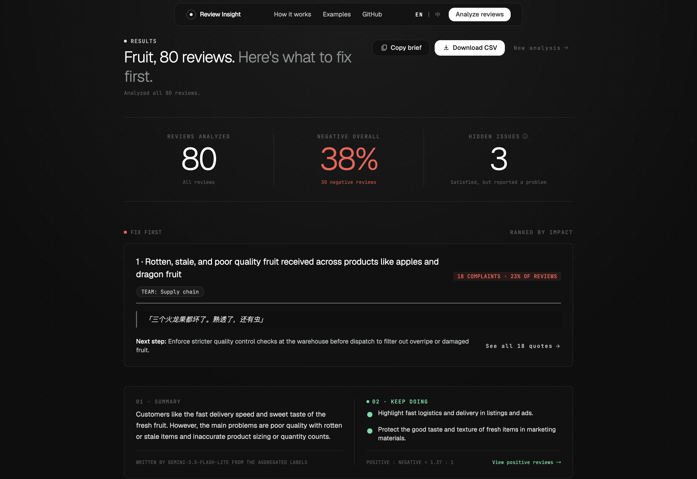
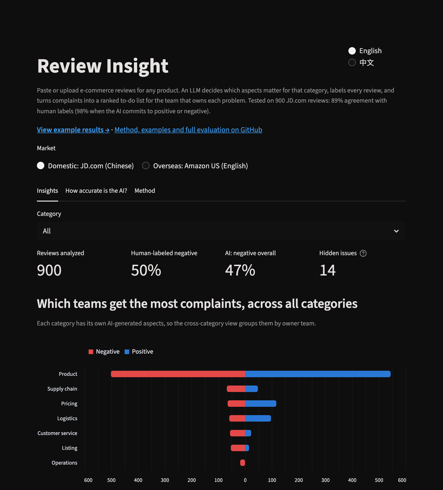
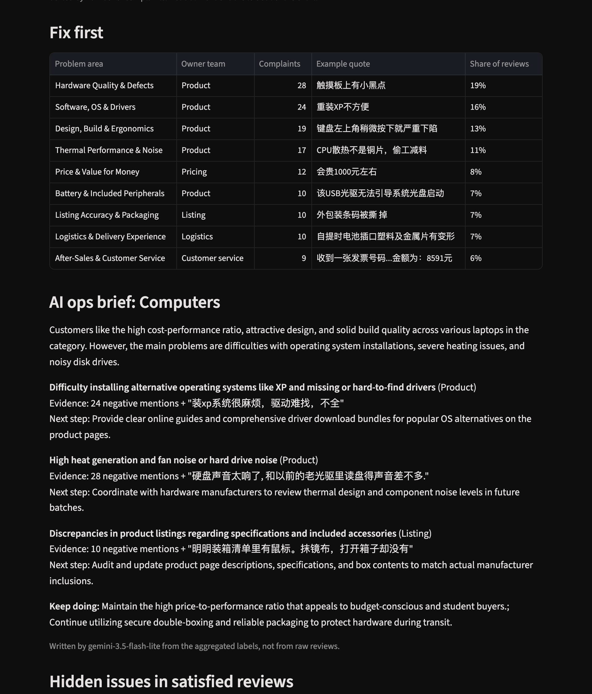
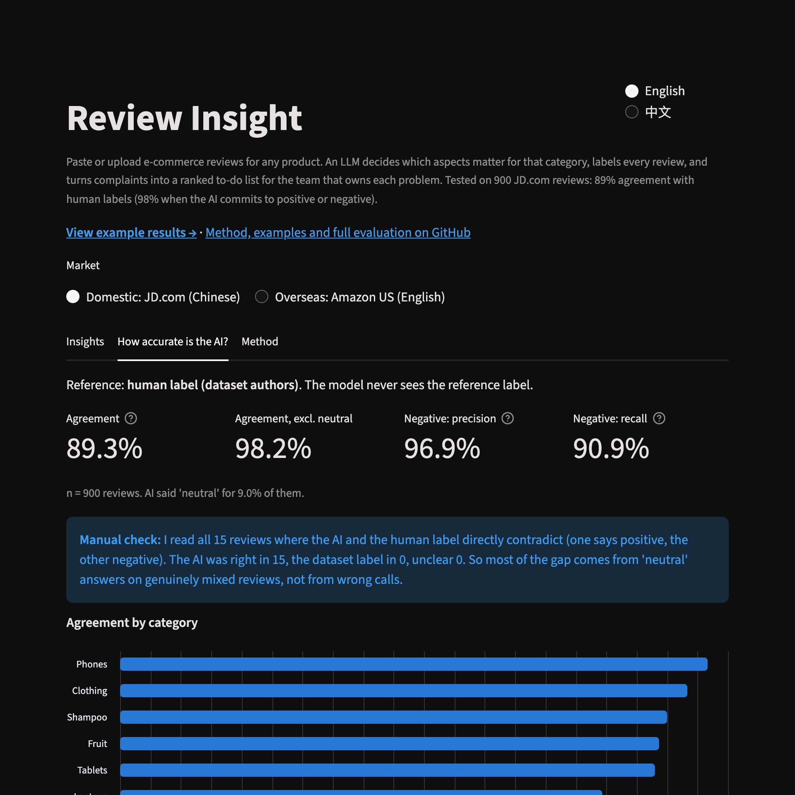

# Review Insight

An LLM tool that reads e-commerce reviews for any product category, decides which aspects matter for that category, and turns complaints into a ranked to-do list for the team that owns each problem. Tested on 900 Chinese JD.com reviews against human labels (89% agreement, 98% when the AI commits to positive or negative), and also run on US Amazon reviews.

> **Live demo: [boxiao-review-insight.streamlit.app](https://boxiao-review-insight.streamlit.app)** (English by default, 中文 on the toggle; bring your own API key)



## Why I built it

I worked in e-commerce and content operations for tea brands on Chinese platforms. Seller back-ends (Taobao Qianniu, JD Jingmai, Douyin Doudian) let you export every review, but nobody has time to read thousands of them. The useful signals, like stale batches, broken packaging, or "only 90 of the 100 bags arrived", stay buried, sometimes inside 5-star reviews. I wanted to see if a low-cost LLM could do that reading reliably, and how to check whether it actually does.

## What it does

1. **Builds aspects for each category.** For tea I wrote the aspect list myself from my own work. For any other category (laptops, fruit, clothing...) the LLM reads real reviews and proposes 6-10 aspects, each mapped to an owner team (Product, Logistics, Customer service, Pricing...). They are saved as JSON so a person can review and edit them.
2. **Labels every review** with overall sentiment, aspect-level sentiment plus an exact evidence quote, a root cause for negative reviews, and a strict repurchase signal.
3. **Finds hidden issues**: satisfied customers who still report a concrete problem. Star ratings alone miss these.
4. **Writes an ops brief** per product or category (what to fix first, which team owns it, next step). It only sees the aggregated counts and quotes.
5. **Measures its own accuracy** against human labels.
6. **Analyzes your own reviews**: upload a CSV/Excel export or paste comments (e.g. from RedNote), pick the platform, and get the same analysis plus an ops brief.
7. **Bring your own model**: Google Gemini, DeepSeek, OpenAI, Anthropic Claude, Qwen, Kimi, GLM, or any OpenAI-compatible endpoint. Keys are used for the session only and never stored.
8. **Runs inside Claude with no API key**: an open-source [Claude skill](skill/review-insight) does the same analysis in a normal Claude chat, and a [prompt](skill/prompt_for_other_ai.md) covers ChatGPT and other chat AIs.

Three ways to use it, for three kinds of users:

| | Who it's for | Size per run | Needs |
|---|---|---|---|
| [Web app](https://boxiao-review-insight.streamlit.app) | Sellers who don't code | 2,000 on Gemini's free tier, up to 10,000 with a paid API | an API key |
| [Claude skill](#use-it-inside-claude-no-api-key) | People who already use Claude | a few hundred reviews | a Claude account |
| [Command line](#run-it) | Full runs and reproducing the results | any size, resumable | Python + an API key |

## How to use the web app

1. Type the product category, e.g. `水果`, `desk`, `笔记本电脑`.
2. Pick the platform the reviews came from (Taobao/Tmall, JD.com, Douyin, RedNote, WeChat Channels, TikTok Shop, Amazon...).
3. Upload the review export from the seller back-end (CSV or Excel; GBK exports work too). The review text, star-rating and date columns are detected automatically and can be changed. Or paste reviews one per line.
4. Choose an AI provider, paste your API key, and click **Analyze**. The page shows each stage (choosing aspects, labeling, writing the brief) with a progress bar and the time left. **Stop and show results so far** ends the run early and keeps what is already labeled.

**How many reviews per run.** Popular listings have tens of thousands of reviews, so the app works in tiers:

| Provider | Reviews per run | Time |
|---|---|---|
| Gemini free tier | random sample of up to 2,000 | about 4 min |
| Paid API (DeepSeek, OpenAI, Claude, Qwen...) | your choice: a 2,000 sample, or everything up to 10,000 | about 2 min / 10 min |
| More than 10,000 | use the command-line pipeline below (any size, can be stopped and resumed) | |

Why 2,000 is the default: a random sample of 2,000 estimates each issue's share within about ±2% (10,000 gets that to about ±1%). Labeling everything pays off when you hunt for rare issues or split results by product or month. Samples are random, not the first rows, because exports are usually sorted by date. If you pick a star-rating or date column, the sample keeps each star level and month at its real share. If a run stops partway (for example the API's daily quota runs out), the reviews already labeled are still shown and downloadable.



You get the result first: the three things to fix first, each with its owner team, complaint count, real quotes and a next step. Below that are a short summary, what to keep doing, a complaints-vs-praise chart by aspect (click an aspect to filter the reviews), hidden issues inside satisfied reviews, a searchable table of every labeled review, and the aspects the AI chose. **Copy brief** copies the summary as plain text for a team chat; **Download CSV** saves every labeled review (UTF-8, opens in Excel).

The page design was prototyped in Google Stitch from a written spec ([docs/PRD.md](docs/PRD.md), prototypes in [docs/stitch/](docs/stitch)) and built as a Streamlit custom component ([ui/](ui)), so the analysis code stays in Python.

## Examples

The two built-in datasets below are the worked examples. Run the app locally and open `http://localhost:8501/?examples=1` to browse them.

**JD.com, 6 categories: complaints grouped by the team that owns them**



**Laptops: fix-first table and the AI ops brief** (quotes stay in the original Chinese)



**How accurate is the AI** (900 JD.com reviews vs. human labels)



## Data

| Market | Dataset | Used for |
|---|---|---|
| Domestic | [online_shopping_10_cats](https://github.com/SophonPlus/ChineseNlpCorpus) (ChineseNlpCorpus): 62k JD.com reviews, each with a human positive/negative label. I use 6 product categories (laptops, tablets, phones, fruit, clothing, shampoo), 150 reviews each, half positive and half negative. | Main analysis and the accuracy test. The model never sees the human label. |
| Overseas | [Amazon Fine Food Reviews](https://snap.stanford.edu/data/web-FineFoods.html) (McAuley & Leskovec, 2013): 15 tea products, 100 reviews each, sampled evenly across 1-5 stars. | Cross-market comparison with the hand-written tea scheme. |

Both are public research datasets. No platform was scraped.

## Results

**Accuracy on 900 JD.com reviews** (human labels from the dataset authors; the model never sees them):

| Metric | Result |
|---|---|
| Agreement with human labels ("neutral" counted as wrong) | **89.3%** |
| Agreement when the AI commits to positive or negative | **98.2%** |
| Negative reviews: precision / recall | 96.9% / 90.9% |
| By category | phones 96.7%, clothing 93.3%, shampoo 90.0%, fruit 88.7%, tablets 88.0%, laptops 79.3% |

**Manual check of the disagreements.** 96 reviews disagree. 81 of them are cases where the AI said "neutral" on a review that really is mixed (e.g. "the box was opened and the barcode torn off, but the laptop works"); the dataset only has positive/negative, so these count as misses. Laptop reviews are the longest and most balanced, which is why that category scores lowest. I read the other 15, where the AI and the human label directly contradict each other, one by one: in all 15 I judged the AI's reading to be the right one and the dataset label to be wrong (e.g. "damaged package, slow delivery, rude courier" labeled positive). The sheet is in `evaluation/manual_check_jd.csv`.

**Aspects are AI-proposed, then checked against the data.** For phones the LLM left out after-sales; 6 of 150 phone reviews mention returns, repairs, invoices or refurbished units, so I added it. I did not add delivery, because 0 of 150 phone reviews mention it. Edits are recorded in each taxonomy file.

**What it surfaces** (examples from the dashboard): the top laptop issue is hardware defects on arrival (28 complaints, owner: Product); for fruit it is freshness and smaller-than-advertised size; on Amazon, 93 of the 4-5 star tea reviews still report a concrete problem, such as fewer tea bags than the box says.

## Use it inside Claude (no API key)

The [`skill/review-insight`](skill/review-insight) folder is a Claude skill. Claude reads and labels the reviews itself in the conversation. Two small Python scripts do the loading, checking (every quote must appear word for word in its review) and counting, so the numbers are exact.

**Install**
- Claude web or desktop app: download [`review-insight.zip`](skill/review-insight.zip) and upload it under Skills in Claude's settings (code execution needs to be on).
- Claude Code: copy the `review-insight` folder into `~/.claude/skills/`.

Then upload a review export (or paste comments) and ask something like "分析这些评论，告诉我该先改什么" / "What should we fix first based on these reviews?".

**Accuracy test.** I ran the skill on 100 random JD.com reviews from the evaluation set. It only saw the review text; the human labels were kept in a separate file and joined afterwards. Same 100 reviews, same human labels:

| | Agreement with human labels | When it commits to positive/negative | "Neutral" answers |
|---|---|---|---|
| Claude skill (in conversation) | **95%** | 97.9% | 3 |
| API pipeline (Gemini Flash-Lite) | 91% | 100% | 9 |

The skill commits more often and gets slightly more of those calls wrong. Of its two contradictions, one praises the laptop overall but lists three complaints ("瑕不掩瑜"), and one finds the shampoo "本身还行" but wants to use it up fast. With 100 reviews the difference between the two is within noise; the point is that the no-API route is in the same range as the tested pipeline. Inputs, labels and the scoring script are in [`evaluation/skill_test/`](evaluation/skill_test). Labeling was done by Claude Opus 5.5 following `SKILL.md`; results can differ with other models.

**Other chat AIs.** ChatGPT, Gemini and DeepSeek can't install Claude skills. [`prompt_for_other_ai.md`](skill/prompt_for_other_ai.md) is a single copy-paste prompt with the same rules. It has not been accuracy-tested.

## Pipeline

```
prepare_jd.py / prepare_amazon.py   -> data/processed/<dataset>_sample.csv
generate_taxonomy.py                -> data/taxonomies/<dataset>__<category>.json
label_reviews.py                    -> data/labels/<dataset>.jsonl
analyze.py                          -> data/app/<dataset>/{reviews,aspects,groups}.csv
evaluate.py                         -> data/app/<dataset>/eval.json, eval_errors.csv
generate_briefs.py                  -> data/app/<dataset>/briefs.json
app.py                              Streamlit dashboard (reads data/app/, no API key needed)
```

LLM: Gemini Flash-Lite on the free tier, 20 reviews per call, structured JSON checked against the category's aspect list. DeepSeek works as a backup (`--provider deepseek`). Runs can be stopped and resumed.

## Run it

```bash
python3 -m venv .venv && source .venv/bin/activate
pip install -r requirements.txt
cp .env.example .env            # paste a free Gemini key from aistudio.google.com
python src/check_api.py

python src/prepare_jd.py
python src/generate_taxonomy.py --dataset jd
python src/label_reviews.py --dataset jd
python src/analyze.py --dataset jd
python src/evaluate.py --dataset jd
python src/generate_briefs.py --dataset jd

streamlit run app.py
```

Same steps with `--dataset amazon_tea` (use `src/prepare_amazon.py`). Tests run offline: `pip install pytest && python -m pytest -q`.

## Limitations

- Both datasets are from about 2010-2014.
- Balanced sampling makes negative shares higher than on a real listing.
- Some human labels in the JD data are noisy (for example, a review marked negative that only complains about the box). Disagreements are saved in `eval_errors.csv` so they can be read, not just counted.
- The Amazon check against star ratings is not independent, because the model sees the stars.
- Repurchase intent is only counted when a review states it explicitly.
- The skill test is one run on 100 reviews. In a chat, output quality depends on the model the user has, so the skill runs its own checks and reports problems instead of hiding them.
