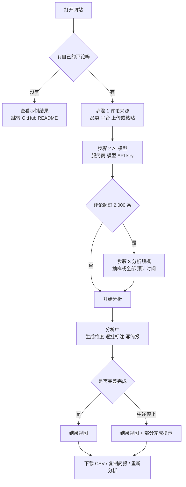

# Review Insight 前端产品需求文档（PRD）

| 项目 | 内容 |
|---|---|
| 产品 | Review Insight：任意品类的电商评论 AI 分析工具 |
| 线上地址 | https://boxiao-review-insight.streamlit.app |
| 代码 | https://github.com/bwu109-netizen/review-insight |
| 文档版本 | v1.1，2026-10-05（改为深色、电影感风格；强调色近黑，默认英文） |
| 风格参考 | [Oliviera - AI Automation SaaS Landing Page](https://dribbble.com/shots/27784786-Oliviera-AI-Automation-SaaS-Landing-Page-Animation)（Dribbble，Bayu Aji Sadewa for Korsa） |
| 作者 | 吴博潇（Boxiao Wu） |
| 用途 | 交给 Stitch 生成原型图；作为前端改版的验收依据 |
| 范围 | 只改前端呈现和交互。分析逻辑、API 调用、数据字段保持不变 |

---

## 1. 产品概述

### 1.1 一句话定义

上传或粘贴任意商品的电商评论，AI 先判断这个品类该看哪些维度，再逐条打标签，最后把差评整理成按优先级排好、分给对应团队的待办清单。

### 1.2 背景

- 淘宝千牛、京东京麦、抖店后台都能导出评价，但没人有时间读几千条。
- 真正有用的信号（批次不新鲜、包装破损、"100 包只到了 90 包"）常常埋在评论里，甚至藏在 5 星好评里。
- 工具已经能用，并在 900 条京东评论上验证：与人工标签一致率 89%，AI 明确判好评或差评时为 98%。
- 现在的问题是页面是 Streamlit 默认样式，像一个内部调试工具，不像一个产品。

### 1.3 改版目标与成功标准

| 目标 | 可验证的标准 |
|---|---|
| 一眼看懂 | 首屏 5 秒内能回答：这是什么、给谁用、怎么开始 |
| 上手快 | 从打开到点「开始分析」，必填步骤不超过 3 步 |
| 结论优先 | 结果页第一屏就是「先改什么」，图表和明细在后面 |
| 可信 | 首屏有验证数字和示例入口，结果里每个结论都附原话 |
| 手机可用 | 375px 宽度下能完整走通一次分析 |
| 极简、有质感 | 全站黑白灰；彩色只出现在数据（投诉红、好评绿）；装饰只用点阵、细线和一处柔光，不用插图和 emoji |

### 1.4 不在本次范围

- 用户注册、登录、历史记录（结果只存在当前会话里）。
- 服务端保存用户的评论或 API key。
- 站内示例报告页（示例仍放在 GitHub README，见第 14 节待确认）。
- 爬取电商平台数据。

---

## 2. 目标用户

| 用户 | 典型身份 | 想要什么 | 对设计的要求 |
|---|---|---|---|
| 中小电商卖家（主要） | 淘宝、京东、抖店的店主或运营专员 | 每周导出一次评价，快速知道该先改什么、交给哪个团队 | 步骤少、结论直白、原话为证、能下载拿去开会 |
| 招生官、面试官（展示） | HKU MAIB、CUHK、HKUST 等项目 | 30 秒内判断项目是否真实、有效、有方法 | 首屏有验证数字，示例结果一键可达，不用自己跑 |
| 数据、产品同行（次要） | 想复用或复现的人 | 看方法、拿代码、用 Claude skill 或命令行 | 页脚放 GitHub、方法、skill 入口，不占主流程 |

---

## 3. 核心使用场景与用户流程

### 3.1 四个场景

1. **周会前出报告（主线）**：卖家从后台导出本周评价，上传后确认自动识别的评论列，选服务商、填 key，开始分析，看「先改什么」，下载 CSV 或复制简报发到工作群。
2. **快速看口碑**：从小红书、视频号复制几十条评论，粘贴后分析。1 分钟内出结果，常在手机上完成。
3. **招生官看项目**：从简历或 PS 的链接进来，首屏看到一句话价值和验证数字，点「查看示例结果」看完整报告。全程不需要 API key。
4. **大文件分析**：上传几万条的导出文件，看到分档选择（抽 2,000 条或全部）和预计时间，等待进度。中途额度用完时，已完成的部分照样出结果。

### 3.2 主流程



---

## 4. 信息架构与页面列表

整个网站是单页应用，按状态切换视图。

| 编号 | 视图 | 出现时机 | 用途 |
|---|---|---|---|
| P1 | 输入视图 | 打开网站时（默认） | 介绍产品，完成评论、模型、规模三步设置 |
| P2 | 分析中视图 | 点「开始分析」后 | 显示分阶段进度和剩余时间 |
| P3 | 结果视图 | 分析完成或中途停止后 | 先给结论，再给图表、明细和下载 |
| P4 | 内部示例页 | 网址加 `?examples=1` | 只用于截 README 图，不对外，本次不改 |
| 外链 | GitHub README | 点「查看示例结果」或页脚链接 | 示例截图、准确率、方法、skill 和命令行入口 |

**布局规则**：P1 和 P3 在同一页上下排列。结果出来后页面自动滚动到 P3，P1 收起成一行摘要（品类 · 条数 · 模型 · 修改）。点「修改」重新展开 P1，已填内容保留。

**页面骨架（桌面）**：

```
┌───────────────────────────────────────────────┐
│ 顶栏 G1（悬浮胶囊）：Review Insight  EN|中  GitHub  [Analyze reviews] │
├───────────────────────────────────────────────┤
│  P1 输入视图                                     │
│    M1 Hero（满屏，点阵 + 柔光背景）                  │
│    M1b 指标带（三个超大细体数字）                     │
│    M1c 痛点列表（#001 到 #004）                    │
│  ───── 以下为工具区，内容列最大宽 720px，居中 ─────    │
│    M2 步骤 1 评论来源                             │
│    M3 步骤 2 AI 模型                              │
│    M4 步骤 3 分析规模（条件出现）                    │
│    M5 操作区                                     │
│  P2 分析中视图（替换 M5 位置）                       │
│  P3 结果视图                                     │
│    R1 结果摘要条                                  │
│    R2 先改什么                                    │
│    R3 一句话总结与继续保持                           │
│    R4 维度图                                     │
│    R5 隐藏问题                                    │
│    R6 评论明细                                    │
│    R7 AI 选的维度                                 │
├───────────────────────────────────────────────┤
│ 页脚 G2：方法 · GitHub · Claude skill · 作者        │
└───────────────────────────────────────────────┘
```

---

## 5. 功能模块详细设计

每个模块说明：目的、内容与字段、交互、状态、数据来源。文案格式为「英文 / 中文」，默认语言英文。

### 5.1 全局模块

#### G1 顶栏

- **目的**：品牌识别、语言切换、外链、随时回到工具。
- **形态**：参考图的悬浮胶囊导航。距顶部 16px，居中，最大宽 720px，高 48px，半透明深灰底（#141414，80% 不透明 + 背景模糊），1px 边框（白色 10%），全圆角。
- **内容**：
  - 左：小图标（细线圆环）+ 文字 Logo「Review Insight」，字重 500。
  - 中：文字链接 How it works / 方法 · Examples / 示例 · GitHub（13px，灰色，悬停变白）。
  - 右：语言切换 `EN | 中`（等宽字体，当前语言为白色）+ 白色小胶囊按钮 Analyze reviews / 开始分析（点击平滑滚动到 M2）。
- **交互**：
  - 默认英文。切换语言后整页文案立即切换，已有输入和结果保留，不重新分析。
  - 滚动时始终悬浮在顶部。
- **移动端**：只保留 Logo、语言切换和一个汉堡菜单，菜单里放其余链接。

#### G2 页脚

- **内容**：一行小字链接：How it works / 方法说明 · GitHub · Use in Claude (no API key) / 在 Claude 里用（无需 API） · Built by Boxiao Wu。
- **样式**：次要文字色，12px，上方 1px 分隔线，上下留白 32px。

### 5.2 P1 输入视图

#### M1 Hero（产品介绍，满屏）

- **目的**：5 秒内讲清价值，同时建立高级感和可信度。
- **版式**：占满第一屏（100vh，最小 640px），内容垂直居中。背景是近黑底 + 很淡的点阵（白色 6% 不透明，间距 24px），中心上方一团柔和的灰白光晕（径向渐变，白色 8% 到透明），模拟参考图里的光感。不用 3D 模型和照片。
- **内容**（从上到下，居中）：
  1. 眉标（等宽字体、全大写、11px、字距 0.12em、灰色）：AI REVIEW ANALYSIS / AI 评论分析
  2. 主标题（大号细体，两色）：前半句白色、后半句灰色，参考图的写法。
     - EN：**Thousands of reviews.** <span style="color:gray">One ranked fix list.</span>
     - 中：**成千上万条评论，**<span style="color:gray">一份排好序的待办清单。</span>
  3. 副标题（16px，灰色，最多两行）：
     - EN：Upload a seller export or paste comments. AI picks the aspects for your category, labels every review, and tells each team what to fix first.
     - 中：上传后台导出的评价或直接粘贴评论。AI 按品类选出分析维度、逐条打标签，并告诉每个团队先改什么。
  4. 两个按钮并排：
     - 主按钮（白底黑字胶囊）：Analyze reviews / 开始分析 → 平滑滚动到 M2
     - 次按钮（透明底、白色 20% 边框）：View example results / 查看示例结果 → 新标签页打开 README#examples
  5. 底部居中一个细小的向下提示（等宽字 SCROLL + 1px 竖线，轻微上下浮动动画）。
- **入场动画**：眉标、标题、副标题、按钮依次淡入上移（每个延迟 80ms，时长 600ms）。

#### M1b 指标带（可信度）

- **目的**：给招生官看的验证数字，参考图的大号细体数字区。
- **版式**：三列等分，列之间 1px 竖线（白色 10%），上方 1px 横线。
- **每列**：上面是等宽小标签（全大写、灰色），下面是超大细体数字（64px，字重 300）+ 小号单位。

| 标签 EN / 中 | 数字 | 单位 |
|---|---|---|
| AGREEMENT WITH HUMAN LABELS / 与人工标签一致率 | 89 | % |
| JD.COM REVIEWS TESTED / 京东评论验证条数 | 900 | reviews / 条 |
| AI PROVIDERS SUPPORTED / 可选 AI 服务商 | 8 | providers / 种 |

- **动画**：滚动进入视口时数字从 0 计数到目标值（800ms）。
- 下方一行灰色小字：98% when the AI commits to positive or negative. Method on GitHub → / AI 明确判好评或差评时一致率 98%，方法见 GitHub →

#### M1c 痛点列表（为什么需要它）

- **目的**：用参考图的编号列表讲清问题，让卖家有共鸣。
- **版式**：左侧大标题，右侧四条编号项；手机上改为上下排列。
  - 左标题（两色）：EN **Your team shouldn't read every review.** <span style="color:gray">But someone has to.</span> / 中 **没人有时间读完每一条评论，**<span style="color:gray">但总得有人读。</span>
  - 右侧四条，每条：等宽编号 + 标题（白色）+ 一行说明（灰色），条目之间 1px 虚线。当前悬停的一条加 1px 白色 20% 边框的卡片框（参考图 #002 的高亮效果）。

| 编号 | 标题 EN / 中 | 说明 EN / 中 |
|---|---|---|
| #001 | Thousands of reviews, no time / 评论太多，没时间看 | Every back-end can export them. Nobody reads them. / 后台都能导出，但没人读 |
| #002 | Problems hide in 5-star reviews / 问题藏在五星好评里 | "Great tea, but only 90 of 100 bags arrived." / 「茶很好，但 100 包只到了 90 包」 |
| #003 | No owner for each complaint / 投诉没人认领 | Packaging, logistics or product? Nobody knows who should act. / 是包装、物流还是产品？不知道该谁改 |
| #004 | Star ratings miss the why / 星级说不出原因 | A 3.8 average doesn't tell you what to fix. / 3.8 分的均分说不出该改什么 |

#### M2 步骤 1：评论来源

- **目的**：拿到要分析的评论和基本信息。
- **工具区开头**：一个居中小标题，眉标 ANALYZE / 开始分析，主标题 EN **Three steps.** <span style="color:gray">Results in minutes.</span> / 中 **三步设置，**<span style="color:gray">几分钟出结果。</span>
- **结构**：步骤标题「01 · REVIEWS / 01 · 评论」（编号和标签用等宽字体）+ 表单。整个步骤放在一个深灰卡片里（#111111，1px 白色 8% 边框，圆角 16px，内边距 32px）。

| 字段 | 控件 | 必填 | 说明 |
|---|---|---|---|
| 商品品类 Product category | 文本输入 | 是 | 占位：e.g. fruit, desk, laptop / 例如：水果、桌子、笔记本电脑。填「茶」时使用手写的茶叶维度表 |
| 平台 Platform | 下拉 | 是 | 淘宝/天猫、京东、抖音、小红书、微信视频号、TikTok Shop、亚马逊、其他。默认第一项 |
| 评论来源 | 分段 Tab：Upload file / 上传文件 · Paste / 粘贴 | 二选一 | 桌面默认「上传」，手机默认「粘贴」 |
| 文件 | 拖拽上传区 | 上传时必填 | 支持 CSV、XLSX，单文件 200MB 内，支持 GBK 编码 |
| 粘贴框 | 多行文本，高 160px | 粘贴时必填 | 每行一条评论 |
| 列映射 | 3 个下拉（折叠面板） | 评论列必填 | 评论内容列（自动选最长的文本列）、评分列（可选，自动识别「评分/星级/rating」）、日期列（可选，自动识别「时间/日期/date」） |

- **交互**：
  - 上传成功后，上传区变成文件卡片：文件名 · 行数 · 移除按钮。
  - 卡片下方一行识别结果：Detected: review text = 评价内容, rating = 评分, date = 评价时间 · Change / 已识别：评论 = 评价内容，评分 = 评分，日期 = 评价时间 · 修改。点「修改」展开列映射。
  - 读入后显示有效条数：12,000 reviews ready (238 empty or duplicate removed) / 已读入 12,000 条（已去掉 238 条空白或重复）。
  - 评分列、日期列的作用要说明（小字）：用于按星级和月份分层抽样，并识别「5 星但有问题」的隐藏问题。

#### M3 步骤 2：AI 模型

- **目的**：用户自带 API key 选模型。
- **结构**：步骤标题「02 · AI MODEL / 02 · AI 模型」+ 表单，卡片样式同 M2。

| 字段 | 控件 | 必填 | 说明 |
|---|---|---|---|
| 服务商 Provider | 下拉 | 是 | Google Gemini（免费额度）、DeepSeek、OpenAI、Anthropic Claude、通义千问、Kimi、智谱 GLM、其他 OpenAI 兼容接口 |
| 模型 Model | 文本输入 | 是 | Gemini 和 DeepSeek 预填；其他留空，占位「填你在服务商后台看到的模型名」 |
| API key | 密码输入，带显示/隐藏 | 是 | 下方一行：Get a key: 链接 · Used for this session only, never stored / 只在本次使用，不会保存 |
| Base URL | 文本输入 | 仅「其他」时 | 收在「高级设置」里，选「其他」时自动展开 |

- **交互**：
  - 切换服务商时，模型框自动换成该服务商的预设；用户手动改过的保留在该服务商下。
  - 服务商名旁边加小标签：Gemini 显示 `Free tier / 免费`，其余显示 `Paid / 付费`，帮用户理解分档。

#### M4 步骤 3：分析规模（条件出现）

- **结构**：步骤标题「03 · SCALE / 03 · 分析规模」，卡片样式同 M2。
- **出现条件**：有效评论超过 2,000 条。否则整个模块不显示，直接分析全部。
- **内容按服务商分两种**：

| 情况 | 显示 |
|---|---|
| Gemini 免费 | 信息条（不是选项）：12,000 reviews uploaded. A random sample of 2,000 will be analyzed (shares within about ±2%). Switch to a paid provider to analyze up to 10,000. / 共 12,000 条，Gemini 免费额度下将随机抽 2,000 条分析（占比误差约 ±2%）。换用付费接口可分析最多 10,000 条。 |
| 付费接口 | 两张单选卡片，见下 |

- **单选卡片（付费接口）**：

| 卡片 | 标题 | 说明 | 角标 |
|---|---|---|---|
| A（默认选中） | Sample 2,000 / 抽样 2,000 条 | About 2 min · shares within ±2% / 约 2 分钟 · 占比误差约 ±2% | Recommended / 推荐 |
| B | All 10,000 / 全部 10,000 条（文件不足 10,000 时显示实际条数） | About 10 min · better for rare issues and per-month breakdowns / 约 10 分钟 · 适合找少见问题、按月细分 | 无 |

- 超过 10,000 条时，卡片 B 标题改为 Sample 10,000 (max) / 抽样 10,000 条（上限），下方小字：To label every review, use the command-line version on GitHub / 如需全部标注，请用 GitHub 上的命令行版本。
- 选了评分列或日期列时，补一行小字：Sampling keeps each star level and month at its real share / 抽样时各星级、月份保持真实比例。

#### M5 操作区

- **内容**：
  - 主按钮：Analyze / 开始分析（全宽，高 52px，白底黑字胶囊，悬停时轻微发光：外圈白色 15% 的 0 0 24px 光晕）。
  - 按钮上方一行预计：2,000 reviews · about 4 min / 2,000 条 · 约 4 分钟。超过 1.5 分钟时加：Keep this tab open / 完成前请不要关闭页面。
- **按钮状态**：
  - 缺必填项时禁用，按钮下方列出缺什么：Still needed: category, API key / 还差：品类、API key。
  - 不用弹窗报错。

### 5.3 P2 分析中视图

- **位置**：替换 M5 操作区，页面不跳转。输入区变为只读、半透明。
- **内容**：
  - 阶段列表（4 步，纵向，当前步加粗，完成步打勾）：
    1. Reading file / 读取文件
    2. Choosing aspects for this category / 为这个品类生成分析维度
    3. Labeling reviews 1,240 / 2,000 / 逐条标注 1,240 / 2,000
    4. Writing the ops brief / 撰写运营简报
  - 进度条：只跟随第 3 步的条数，细线（高 4px）。
  - 剩余时间：About 2 min left / 预计还剩 2 分钟（按已用时间和完成比例估算）。
  - 停止按钮（次要样式）：Stop and show results so far / 停止并查看已完成部分。
- **规则**：
  - 任何超过 1 秒的等待都要有反馈，不能只转圈。
  - 完成后自动滚动到 R1。

### 5.4 P3 结果视图

模块按「结论 → 证据 → 明细」排序。

#### R1 结果摘要条

- **内容**：
  - 区块标题（两色，同参考图）：眉标 RESULTS / 结果；主标题 EN **Fruit, 2,000 reviews.** <span style="color:gray">Here's what to fix first.</span> / 中 **水果，2,000 条评论。**<span style="color:gray">先改这几件事。</span>
  - 一行范围说明：Analyzed a random sample of 2,000 out of 12,000 reviews, keeping each star level and month at its real share. / 从 12,000 条评论中随机抽取 2,000 条分析，各星级、月份按实际比例抽取。（未抽样时：Analyzed all 380 reviews / 已分析全部 380 条评论）
  - 三个指标（与 M1b 同样式：等宽小标签 + 大号细体数字，列间 1px 竖线）：
    - Reviews analyzed / 分析评论数：2,000
    - Negative overall / AI 判为差评：24%
    - Hidden issues / 隐藏问题：37（带 ⓘ 提示：整体满意、但仍提到具体问题的评论）
  - 右侧操作：Download CSV / 下载 CSV · Copy brief / 复制简报 · New analysis / 重新分析
- **部分完成时**：摘要条上方加提示条（深灰底、左侧 2px 琥珀色竖线）：The run stopped early, so these results cover 1,240 of 2,000 reviews. Reason: daily quota used up. / 分析中途停止，以下结果只包含 2,000 条中的 1,240 条。原因：额度用完。

#### R2 先改什么（核心模块）

- **目的**：结果页最重要的内容，第一屏必须看到。
- **内容**：最多 3 张卡片，按影响排序，纵向排列。每张卡片：

| 元素 | 示例 |
|---|---|
| 序号 + 问题 | 1 · 到货时水果已坏 |
| 负责团队标签 | 供应链 / 质检 |
| 依据 | 23 条投诉，占 11% |
| 原话（引用样式） | 「打开包装三个火龙果均已坏成这样」 |
| 下一步 | 发货前增加一次品控抽检，夏季改冷链 |
| 展开链接 | See all 23 quotes / 查看全部 23 条原话 |

- **交互**：点「查看全部原话」在卡片内展开列表（最多 20 条，可滚动），不跳页。
- **数据来源**：简报 `fix_first`（issue、owner、evidence、action）+ 维度统计（投诉数、占比、原话）。
- **简报生成失败时**：卡片退化为按投诉数排序的前 3 个维度（维度名、团队、投诉数、一条原话），上方小字说明简报未生成。

#### R3 一句话总结与继续保持

- **内容**：
  - 总结段落（2 句，正文字号）：来自简报 `summary`。
  - Keep doing / 继续保持：1 到 2 条，来自简报 `keep_doing`，用浅绿圆点列表。
- **样式**：无卡片边框，靠留白分隔。

#### R4 维度图

- **标题**：What customers talk about, and how they feel / 顾客在聊什么，态度如何
- **图表**：横向对称条形图。中轴左侧红色为投诉数，右侧绿色为好评数，维度按投诉数从多到少排列，数字直接标在条末端。
- **规则**：无网格线、无图例框（颜色说明写在标题下一行小字）、每行高 32px、维度名用当前语言。
- **交互**：
  - 悬停显示：维度 · 负责团队 · 投诉 n · 好评 n · 中性 n。
  - 点击某一维度，R6 评论明细自动筛选到该维度并滚动过去。

#### R5 隐藏问题

- **标题**：Hidden issues in satisfied reviews / 满意评论里的隐藏问题
- **说明**（一行小字）：Customers who were happy overall but still reported a concrete problem. Star ratings miss these. / 整体满意、但仍提到具体问题的评论，只看星级会漏掉。
- **内容**：列表，每条一行：问题维度标签 · 原话（加粗）· 完整评论（灰色，单行截断，点击展开）· 星级（有评分列时）。
- 默认显示 5 条，Show all 37 / 查看全部 37 条。

#### R6 评论明细

- **内容**：全部已标注评论的表格。
- **列**：评论原文 · 整体情感（彩色小圆点 + 文字）· 维度标签 · 根因 · 复购信号 · 星级（有时）
- **工具栏**：
  - 筛选：情感（多选，默认「差评」）、维度（多选）
  - 搜索框：在评论原文里搜关键词
  - 计数：Showing 112 of 2,000 / 显示 2,000 条中的 112 条
- **规则**：表格内滚动，最多显示 400px 高；长评论单行截断，点击行展开。

#### R7 AI 选的维度

- **默认折叠**，标题：Aspects chosen by AI for this category (8) / AI 为这个品类选的分析维度（8 个）
- **展开后**：每个维度一行：名称 · 负责团队 · 说明（description）。
- 底部小字：Aspects are generated from a sample of your reviews. / 维度由 AI 读取部分评论后生成。

---

## 6. 视觉规范

### 6.1 风格关键词

深色 · 电影感 · 黑白灰 · 克制 · 技术感 · 大留白 · 文字优先

参考 Oliviera 落地页（见文档开头）。从它身上借：

- 近黑背景，白色和灰色两级文字，几乎不用彩色。
- 大号细体标题，一句话里前半白、后半灰。
- 等宽字体的小号大写标签和编号（如 `AI REVIEW ANALYSIS`、`#001`、`01 · REVIEWS`）。
- 超大细体数字做指标。
- 点阵、1px 细线、一处柔光做装饰。
- 白底黑字的胶囊主按钮，悬浮胶囊导航。

不借的：3D 物体、风景照片、大段滚动叙事动画。我们是工具，主角是表单和结果。

### 6.2 颜色（深色为默认且唯一主题）

主色调是近黑。主按钮在深色背景上用白底黑字，这样整页仍是黑白两色，只有数据带颜色。

| Token | 用途 | 色值 |
|---|---|---|
| `bg` | 页面背景 | #0A0A0A |
| `surface` | 卡片、步骤区背景 | #111111 |
| `surface-2` | 输入框、表格行悬停 | #1A1A1A |
| `border` | 卡片和输入框边框 | rgba(255,255,255,0.08) |
| `border-strong` | 聚焦、选中、悬停高亮 | rgba(255,255,255,0.24) |
| `text-primary` | 标题、正文 | #F5F5F5 |
| `text-secondary` | 说明、两色标题的灰色部分 | #8A8A8A |
| `text-tertiary` | 等宽标签、页脚、占位符 | #5C5C5C |
| `button-primary` | 主按钮底色（文字为 #0A0A0A） | #F5F5F5 |
| `dot-grid` | 点阵 | rgba(255,255,255,0.06) |
| `glow` | Hero 柔光 | 径向渐变 rgba(255,255,255,0.08) 到透明 |
| `negative` | 投诉、差评（只用于数据） | #E5675A |
| `positive` | 好评（只用于数据） | #5FB58A |
| `neutral` | 中性 | #6B6B6B |
| `warning` | 部分完成提示条：左侧 2px 竖线 + 文字 | #E0B04A |

### 6.3 字体

| 用途 | 字体 |
|---|---|
| 标题和正文（英文） | Inter（或 Geist），标题用 300 到 400 细字重 |
| 中文 | PingFang SC / Noto Sans SC |
| 标签、编号、数字单位、代码感文字 | JetBrains Mono / Geist Mono，全大写，字距 0.12em |

| 层级 | 字号 / 行高 | 字重 | 用途 |
|---|---|---|---|
| Display | 64 / 68 | 300 | Hero 主标题（手机 36 / 42） |
| Stat | 64 / 64 | 300 | M1b 指标数字 |
| H2 | 36 / 44 | 300 | 区块主标题（两色） |
| H3 | 18 / 26 | 500 | 卡片标题、步骤标题 |
| Body | 15 / 24 | 400 | 正文、表单 |
| Small | 13 / 20 | 400 | 说明、表格 |
| Mono label | 11 / 16 | 400 | 眉标、编号、列表头 |

- 标题字距略收紧（-0.02em）。数字用等宽数字（tabular-nums）。

### 6.4 间距与布局

- 8px 栅格。大区块之间 160px（营造电影感的呼吸），工具区内模块之间 48px，字段之间 20px。
- Hero 和 M1b、M1c 用宽版（最大 1120px）；工具区和结果区内容列最大 720px，R4、R6 可放宽到 960px。
- 圆角：卡片 16px，输入框 10px，按钮和标签全圆角（胶囊）。
- 边框 1px；不用投影。只在两处用光：Hero 柔光、主按钮悬停光晕。

### 6.5 组件风格

- **输入框**：#1A1A1A 底，1px 白色 8% 边框，高 44px；聚焦时边框变白色 24%，无发光。占位文字 #5C5C5C。
- **下拉、分段控件**：与输入框同风格；分段控件选中项为 #262626 底 + 白字。
- **步骤卡片**：#111111 底，1px 边框，圆角 16px。左上角等宽编号 `01`、`02`、`03`。完成的步骤编号变白并加小对勾。
- **单选卡片（M4）**：未选中为 1px 白色 8% 边框；选中为 1px 白色 40% 边框 + 右上角白色实心小圆点。
- **标签（团队、维度）**：胶囊，#1A1A1A 底，12px 灰字；团队标签前加一个等宽小前缀如 `TEAM`。
- **引用原话**：左侧 2px 白色 20% 竖线，正文白色，中文用「」。
- **按钮**：主按钮白底黑字胶囊；次按钮透明底 + 1px 白色 20% 边框；文字按钮灰色，悬停变白。
- **图标**：线性图标（Lucide 风格），1.5px 线宽，灰色。不使用 emoji。

### 6.6 图表

- R4 横向对称条形图：投诉在左（#E5675A），好评在右（#5FB58A），中轴 1px 白色 20%。
- 维度名白色，数字直接标在条末端（等宽字体、灰色）。
- 无网格线、无坐标轴；背景用极淡的点阵延续页面质感。
- 条高 14px，行高 36px，条形圆角 7px。
- 进入视口时条形从中轴向两侧展开（400ms）。

### 6.7 动效

| 位置 | 动效 | 时长 |
|---|---|---|
| 区块标题、卡片 | 滚动进入时淡入 + 上移 16px | 600ms，ease-out |
| M1b 数字 | 从 0 计数到目标值 | 800ms |
| M1c 列表 | 悬停项出现细框 | 150ms |
| P2 当前阶段 | 编号旁一个小圆点呼吸闪烁 | 1.2s 循环 |
| R4 条形 | 从中轴展开 | 400ms |

- 用户系统开启「减少动态效果」时，全部动效关闭。

## 7. 交互规范

| 交互 | 规则 |
|---|---|
| 必填校验 | 不弹窗。按钮禁用，并在按钮下方列出缺少的项 |
| 自动识别 | 上传后自动识别评论列、评分列、日期列，显示识别结果，可一键修改 |
| 服务商切换 | 模型框自动填预设；每个服务商单独记住用户输入的 key 和模型 |
| 分档选择 | 仅大文件出现；切换选项时预计时间实时更新 |
| 分析过程 | 页面不跳转；输入区只读；可「停止并查看已完成部分」 |
| 结果保留 | 切换语言、点下载、展开收起都不丢结果 |
| 重新分析 | 回到 P1 并保留已填内容，清空旧结果前不需要二次确认 |
| 下载 | CSV 使用 UTF-8 BOM 编码，Excel 打开中文不乱码；文件名 `review-insight_<品类>_<日期>.csv` |
| 复制简报 | 复制为纯文本（总结 + 先改什么 + 继续保持），复制后按钮文字变「已复制」2 秒 |
| 图表联动 | 点 R4 某维度，R6 自动筛选到该维度并滚动 |
| 外链 | 示例结果、GitHub 在新标签页打开 |
| 隐私 | key 输入框下方始终显示「只在本次使用，不会保存」 |

---

## 8. 状态设计

### 8.1 空状态

| 场景 | 显示 | 用户可做 |
|---|---|---|
| 首次进入，未填任何内容 | P1 正常显示，结果区不显示；M5 下方：Fill in a category, add reviews, and add an API key to start / 填写品类、添加评论并提供 API key 后即可开始 | 填表或点「查看示例结果」 |
| 文件读入后有效评论为 0 | 文件卡片标红：No usable reviews found. Check the review text column. / 没有找到可用的评论，请检查评论列 | 修改列映射或换文件 |
| 分析结果没有投诉 | R2 显示：No clear complaints found in these reviews. / 这批评论里没有发现明显投诉。然后直接显示「继续保持」 | 下载、重新分析 |
| 没有隐藏问题 | R5 一行灰字：None found / 没有发现 | 无 |
| 筛选后表格为空 | R6 表格区：No reviews match these filters / 没有符合筛选条件的评论 · Clear filters / 清除筛选 | 清除筛选 |

### 8.2 加载状态

| 阶段 | 预计时长 | 显示 |
|---|---|---|
| 读取文件 | 小于 1 秒到数秒 | 上传区内细进度条 + Reading file / 正在读取 |
| 生成维度 | 5 到 15 秒 | P2 第 2 步高亮，不确定进度的细条动画 |
| 逐批标注 | 1 到 10 分钟 | P2 第 3 步，确定进度条 + 条数 + 剩余时间 |
| 写简报 | 5 到 15 秒 | P2 第 4 步高亮 |
| 结果区首次渲染 | 小于 1 秒 | R 模块骨架屏（灰色块），不显示空白 |

### 8.3 错误与部分完成状态

| 场景 | 显示位置 | 文案（EN / 中） | 用户可做 |
|---|---|---|---|
| API key 无效（401/403） | M3 key 输入框下，红字 | This key was rejected. Check it and try again. / 这个 key 无效，请检查后重试 | 改 key 后重试 |
| 模型名错误（404） | M3 模型框下，红字 | Model not found. Copy the exact name from your provider's console. / 找不到这个模型，请从服务商后台复制准确的模型名 | 改模型名 |
| 额度用完或限流 | R1 上方提示条（琥珀色竖线） | The run stopped early, so these results cover {d} of {n} reviews. Reason: {原因} / 分析中途停止，以下结果只包含 {n} 条中的 {d} 条。原因：{原因} | 查看已有结果、稍后重新分析 |
| 部分批次失败 | R1 上方提示条（琥珀色竖线） | {m} of {n} reviews could not be labeled. Try again for a full run. / {n} 条中有 {m} 条未能标注，可重试以获得完整结果 | 同上 |
| 简报生成失败 | R2 上方灰色提示 | Labels are ready, but the ops brief could not be generated. / 标注已完成，但运营简报生成失败 | R2 退化为按投诉数排序 |
| 文件无法读取 | 上传区，红字 | Couldn't read this file. Save it as CSV (UTF-8 or GBK) or XLSX. / 无法读取这个文件，请另存为 CSV（UTF-8 或 GBK）或 XLSX | 换文件 |
| 网络断开 | 页面顶部条 | Connection lost. Results so far are kept. / 连接中断，已有结果会保留 | 刷新 |

---

## 9. 移动端适配

| 断点 | 规则 |
|---|---|
| ≥ 1024px | 内容列 720px，R4 和 R6 放宽到 960px |
| 640 到 1023px | 内容列占满，左右边距 24px |
| < 640px（以 375px 为基准） | 单列布局，左右边距 16px |

手机端的具体规则：

- **表单**：所有并排字段（品类和平台、服务商和模型）改为上下单列。
- **评论来源**：默认选中「粘贴」Tab（手机上找文件不方便）。
- **主按钮**：全宽；工具区内固定在屏幕底部（sticky），底色 #0A0A0A + 上边 1px 白色 8% 线。
- **Hero**：主标题 36px，按钮上下排列且全宽；高度不强制满屏（最小 560px）。
- **M1b 指标带**：三列改为纵向三行，数字 48px，行间 1px 横线。
- **M1c 痛点**：标题在上、四条列表在下；去掉悬停框，改为每条都带 1px 底线。
- **点阵和柔光**：保留，但光晕缩小到屏宽的 80%。
- **R1 数字卡**：三张卡改为一行三列小卡（数字 20px），操作按钮收进「⋯」菜单。
- **R2 卡片**：全宽，原话最多显示 3 行。
- **R4 图表**：维度名放在条形上方一行，条形占满宽度。
- **R6 表格**：改为卡片列表，每条评论一张卡（原文 + 情感点 + 维度标签），筛选收进底部抽屉。
- **触控**：可点区域不小于 44 × 44px；正文不小于 15px。
- **验收**：在 375 × 812 下走通场景 2（粘贴 30 条评论并分析）。

---

## 10. 关键文案表

| Key | English | 中文 |
|---|---|---|
| value_prop | Turn thousands of reviews into a ranked fix list, with the team that owns each problem. | 把成千上万条评论，变成按优先级排好、分给对应团队的待办清单。 |
| sub | Any category, any platform. Upload a seller export or paste comments. | 任意品类、任意平台。上传后台导出的评价，或直接粘贴评论。 |
| examples | View example results → | 查看示例结果 → |
| step1 | Reviews | 评论 |
| step2 | AI model | AI 模型 |
| step3 | How many to analyze | 分析规模 |
| analyze | Analyze | 开始分析 |
| privacy | Used for this session only, never stored. | 只在本次使用，不会保存。 |
| fix_first | Fix first | 先改什么 |
| keep | Keep doing | 继续保持 |
| aspects | What customers talk about, and how they feel | 顾客在聊什么，态度如何 |
| hidden | Hidden issues in satisfied reviews | 满意评论里的隐藏问题 |
| all_reviews | All labeled reviews | 全部标注结果 |
| download | Download CSV | 下载 CSV |
| copy | Copy brief | 复制简报 |
| new | New analysis | 重新分析 |

---

## 11. 数据与字段说明（前端可用的数据）

后端已经提供以下数据，前端只负责展示，不需要新增接口。

| 数据 | 字段 | 用在哪 |
|---|---|---|
| 维度表 `tax.aspects[]` | key、label_en、label_zh、owner、description | R4、R7、标签 |
| 每条评论 `R` | review_id、text、rating、overall_sentiment、root_cause、repurchase、hidden_issue、ai_negative | R1、R5、R6、下载 |
| 维度标注 `A` | review_id、aspect、sentiment、evidence | R2 原话、R4 统计、R5、R6 标签 |
| 运营简报 `brief` | name、summary、fix_first[issue、owner、evidence、action]、keep_doing[] | R2、R3、复制简报 |
| 运行信息 | n_total、n_sample、sampled、stratified、run_err | R1 范围说明、部分完成提示 |
| 进度回调 | done、total | P2 进度条和剩余时间 |

---

## 12. 技术约束与实现路线

当前网站基于 Streamlit。它对布局的控制有限，下面的设计在两条路线上的可实现程度不同。

| 路线 | 做法 | 工作量 | 能还原的程度 | 风险 |
|---|---|---|---|---|
| A：在 Streamlit 内改（推荐先做） | `.streamlit/config.toml` 设深色主题和字体，注入 CSS（点阵背景、柔光、两色标题、等宽标签、胶囊按钮、卡片），Hero 和指标带用 `st.html` 写静态 HTML，按本 PRD 重排模块和文案 | 2 到 3 天 | 约 70%：深色配色、字体、两色标题、点阵柔光、指标带、痛点列表、卡片样式都能做 | 悬浮胶囊导航、数字计数和滚动入场动画、底部固定按钮、表格转卡片、骨架屏较难或做不到 |
| B：前端重写 | React / Next.js 页面 + Python 分析服务做 API | 1 到 2 周 | 约 95% | 需要单独部署后端；用户 key 要经过后端，安全说明要更清楚 |

建议：申请截止前（CUHK FinTech 11/6）先按路线 A 上线，原型图按本 PRD 的完整效果画。路线 B 作为之后的升级。

Streamlit 下已知做不到或要降级的点：

- 分析中途「停止」按钮：Streamlit 运行中难以响应按钮，先用右上角自带的 Stop。
- 手机底部固定主按钮、R6 转卡片列表：降级为普通按钮和可横向滚动的表格。
- 骨架屏：降级为阶段文字 + 进度条。
- 悬浮胶囊导航：降级为页面顶部的普通一行（Logo、链接、语言切换），不悬浮。
- 滚动入场动画、数字计数：降级为静态；Hero 的依次淡入可以用纯 CSS 动画实现。

---

## 13. 给 Stitch 的使用说明

### 13.1 要出的画面

| 编号 | 画面 | 设备 |
|---|---|---|
| S1 | 落地部分：Hero + 指标带 + 痛点列表 | 桌面 1440（长图）、手机 375 |
| S2 | 工具区空状态：三步卡片 + 禁用的 Analyze 按钮 | 桌面、手机 |
| S3 | 工具区：已上传 12,000 条大文件，付费服务商，出现分档卡片 | 桌面 |
| S4 | 分析中（第 3 步进行到 62%） | 桌面、手机 |
| S5 | 结果视图，完整完成（R1 到 R7） | 桌面 1440（长图）、手机 375 |
| S6 | 结果视图，部分完成（提示条） | 桌面 |
| S7 | 错误状态：API key 无效 | 桌面 |

建议先出 S1 和 S5 两张定调，满意后再出其余画面。

### 13.2 通用风格提示词（每次都带上）

```
Dark, cinematic, minimal SaaS web app for AI analysis of e-commerce reviews.
Style reference: a premium AI automation landing page with a near-black
background (#0A0A0A), white and gray text only, and almost no color.
Large light-weight headlines (Inter 300) where the first half of the sentence
is white and the second half is gray. Small uppercase monospace labels with
wide letter spacing (e.g. "AI REVIEW ANALYSIS", "#001", "01 · REVIEWS").
Huge thin numbers for stats. Decoration only from a faint dot grid, 1px
hairlines (white at 8%) and one soft white glow behind the hero. Primary
buttons are white pills with black text; secondary buttons are transparent
pills with a thin white border. Cards are #111111 with a 1px subtle border
and 16px radius. No shadows, no 3D objects, no photos, no emoji. Red (#E5675A)
and green (#5FB58A) appear only in data: complaints vs praise. Lots of
negative space, calm and premium.
```

### 13.3 分画面提示词

**S1 落地部分**

```
Floating pill-shaped navigation bar centered at the top, semi-transparent
dark with a thin border: small ring icon + "Review Insight" on the left;
links "How it works", "Examples", "GitHub" in the middle; on the right a
monospace "EN | 中" switch and a small white pill button "Analyze reviews".
Full-screen hero, centered: faint dot grid background with a soft white glow
above the center. Monospace eyebrow "AI REVIEW ANALYSIS". Huge thin headline
on two lines: "Thousands of reviews." in white, "One ranked fix list." in
gray. Gray subtitle: "Upload a seller export or paste comments. AI picks the
aspects for your category, labels every review, and tells each team what to
fix first." Two pill buttons: white "Analyze reviews", outlined "View example
results". A tiny "SCROLL" label with a thin vertical line at the bottom.
Stats band: three columns separated by hairlines, each with a small uppercase
monospace label and a huge thin number: "AGREEMENT WITH HUMAN LABELS 89%",
"JD.COM REVIEWS TESTED 900", "AI PROVIDERS SUPPORTED 8". Under it a gray
line: "98% when the AI commits to positive or negative. Method on GitHub →".
Problem section: on the left a two-tone headline "Your team shouldn't read
every review." (white) "But someone has to." (gray). On the right a numbered
list with monospace numbers: "#001 Thousands of reviews, no time",
"#002 Problems hide in 5-star reviews" (highlighted with a thin bordered
card), "#003 No owner for each complaint", "#004 Star ratings miss the why",
each with a one-line gray description and dashed separators.
```

**S2 工具区（空状态）**

```
Section intro centered: monospace eyebrow "ANALYZE", two-tone headline
"Three steps." (white) "Results in minutes." (gray).
Three stacked dark cards (#111111, thin border, 16px radius), each with a
monospace step number at the top left.
Card "01 · REVIEWS": input "Product category" (placeholder "e.g. fruit, desk,
laptop"), dropdown "Platform" (Taobao / Tmall), segmented control
"Upload file | Paste", a dashed drop zone "Drop a CSV or Excel export here".
Card "02 · AI MODEL": dropdown "Provider" showing "Google Gemini" with a small
"FREE TIER" tag, input "Model" prefilled "gemini-3.5-flash-lite", password
input "API key", gray helper "Used for this session only, never stored."
Below the cards: a full-width white pill button "Analyze" in a disabled state
(white at 30%), and gray text "Still needed: category, reviews, API key".
Footer: a hairline, then small gray links "How it works · GitHub · Use in
Claude (no API key) · Built by Boxiao Wu".
```

**S3 大文件 + 分档**

```
Same cards as S2, filled in. Card 01 shows a file row "reviews_export.csv ·
12,000 rows · Remove" and a gray line "Detected: review text = 评价内容,
rating = 评分, date = 评价时间 · Change". Card 02 provider "DeepSeek" with a
"PAID" tag. Card "03 · SCALE" with two selectable cards side by side:
selected card (brighter border, small white dot) "Sample 2,000",
"About 2 min · shares within ±2%", monospace badge "RECOMMENDED"; other card
"All 10,000", "About 10 min · better for rare issues and per-month
breakdowns". Gray note "Sampling keeps each star level and month at its real
share." Enabled white pill "Analyze", above it "2,000 reviews · about 2 min ·
Keep this tab open".
```

**S4 分析中**

```
The three cards dimmed. In place of the button, a minimal vertical progress
list with monospace numbers: "01 Reading file" (done, check), "02 Choosing
aspects for this category" (done, check), "03 Labeling reviews 1,240 / 2,000"
(current, white, with a small pulsing dot), "04 Writing the ops brief"
(gray, pending). A thin 2px white progress bar at 62% on a dark track.
Monospace "ABOUT 1 MIN LEFT". A gray text button "Stop and show results so far".
```

**S5 结果视图**

```
Monospace eyebrow "RESULTS", two-tone headline "Fruit, 2,000 reviews."
(white) "Here's what to fix first." (gray). A gray line "Random sample of
2,000 out of 12,000 reviews, keeping each star level and month at its real
share." Three stat columns with hairline separators and big thin numbers:
"REVIEWS ANALYZED 2,000", "NEGATIVE OVERALL 24%", "HIDDEN ISSUES 37".
Pill buttons on the right: "Download CSV", "Copy brief", "New analysis".
Section "FIX FIRST": three stacked dark cards. Card 1: monospace "#01",
title "Fruit arrives spoiled", a pill tag "TEAM Supply chain / QC",
monospace "23 COMPLAINTS · 11% OF REVIEWS", a quote with a thin white left
rule "打开包装三个火龙果均已坏成这样", "Next step: add a QC check before
shipping; use cold chain in summer", link "See all 23 quotes →".
A two-sentence summary in gray, then "KEEP DOING" with two short items.
Section "WHAT CUSTOMERS TALK ABOUT": a horizontal diverging bar chart on a
faint dot grid, coral complaint bars to the left of a thin center line, green
praise bars to the right, 8 aspects sorted by complaints, numbers in monospace
at the bar ends, no gridlines.
Section "HIDDEN ISSUES IN SATISFIED REVIEWS": 5 rows with an aspect pill, a
white quote and a truncated gray full review; link "Show all 37".
Section "ALL LABELED REVIEWS": filter pills, a dark search input, monospace
"SHOWING 112 OF 2,000", and a minimal dark table with columns Review,
Sentiment (colored dot), Aspects (pills), Root cause, Repurchase.
A collapsed row "Aspects chosen by AI for this category (8)".
```

**S6 部分完成**：与 S5 相同，标题上方加一条提示：深灰底、左侧 2px 琥珀色竖线，文字「The run stopped early, so these results cover 1,240 of 2,000 reviews. Reason: daily quota used up.」

**S7 key 无效**：与 S2 相同，已填内容；API key 输入框边框变为 #E5675A，下方同色小字「This key was rejected. Check it and try again.」

**手机版补充提示词**（S1、S2、S4、S5 的 375px 版本）

```
Mobile 375px, same dark style. Nav collapses to logo, "EN | 中" and a menu
icon. Hero headline 36px, buttons stacked full width. Stats become three rows
separated by hairlines. Problem list below its headline. Paste tab selected
by default in card 01. Sticky full-width white "Analyze" pill at the bottom.
Fix-first cards full width. In the bar chart, aspect names sit above each bar.
The reviews table becomes a list of dark cards; filters open in a bottom sheet.
```

### 13.4 中文版

每个画面可再生成一版中文界面，文案见第 5 节和第 10 节。中文标题同样前半白、后半灰。

---

## 14. 已确认与待确认

**已确认（2026-10-05）**

- 主色调近黑，深色主题；主按钮白底黑字。
- 默认语言英文，可切换中文。
- 风格参考 Oliviera 落地页（深色、电影感、等宽标签、大号细体）。

**待确认**

1. **站内示例**：是否在网站上加一个不需要 API key 的示例结果页？招生官体验会更顺，但之前决定示例只放 README。
2. **浅色模式**：是否需要提供浅色切换？本版只做深色。
3. **实现路线**：先在 Streamlit 内改（路线 A），还是直接重写前端（路线 B）？
4. **Hero 视觉**：参考图用了 3D 物体和风景照片。本版只用点阵和柔光。是否要加一个抽象的视觉元素（比如由点组成、缓慢旋转的环）？

---

## 15. 验收清单

- [ ] 首屏（1440 × 900）是满屏 Hero：眉标、两色主标题、副标题、两个按钮，点「Analyze reviews」平滑滚动到步骤 1
- [ ] 必填未完成时，按钮禁用并列出缺少的项
- [ ] 上传 GBK 编码的 CSV 能正确读取并自动识别评论列
- [ ] 超过 2,000 条时出现分档；Gemini 只显示信息条，付费接口显示两张卡片
- [ ] 分析中显示 4 个阶段、条数进度和剩余时间
- [ ] 结果第一屏可见 R1 和 R2 的第一张卡片
- [ ] 中途停止时显示部分完成提示，已完成的结果可下载
- [ ] 切换语言后结果不丢失
- [ ] 下载的 CSV 用 Excel 打开中文不乱码
- [ ] 375px 下走通「粘贴 30 条评论并分析」
- [ ] 全站黑白灰；红绿只用于数据；除 Hero 柔光和主按钮悬停光晕外无发光、无投影；无 emoji
- [ ] 默认英文，深色主题
